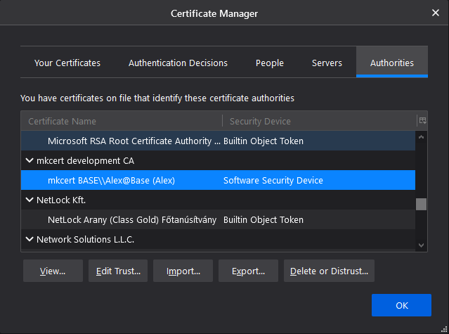
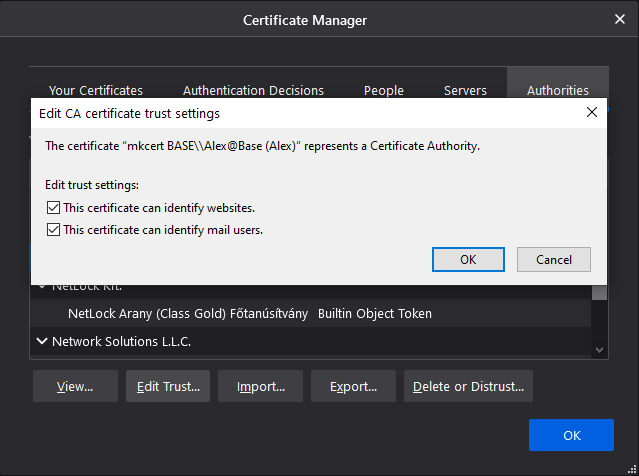

# nginx-ssl-php-db
Local development environment: nginx + SSL + php + postgres + adminer

## Project tree

<pre>
├───conf
│   ├───certs
│   ├───nginx
│   ├───php
│   └───postgres
├───logs
│   ├───nginx
│   ├───php
│   └───postgres
├───postgres
│   └───pgdata
└───src
</pre>


## Docker Images
+ [PHP:fpm-alpine](https://hub.docker.com/_/php)
+ [Postrges:alpine](https://hub.docker.com/_/postgres)
+ [Nginx:alpine](https://hub.docker.com/_/nginx)
+ [Adminer](https://hub.docker.com/_/adminer)

This project use the following ports:

| Server     | Port |
|------------|------|
| Postgres   | 5432 |
| Adminer    | 8080 |
| Nginx      |   80 |
| Nginx SSL  |  433 |
| PHP-FPM    | 9000 |


# SSL for localhost

Install mkcert.

```shell
choco install mkcert
```

Install RootCA
```shell
mkcert -install
```

Create certificates for localhost (or other hostname)
```shell
mkcert localhost
```

Copy them to /conf/certs and change nginx [config](conf/nginx/localhost.conf) options <code>ssl_certificate</code> and <code>ssl_certificate_key</code>
```nginx
    ssl_certificate /etc/nginx/certs/localhost.pem;
    ssl_certificate_key /etc/nginx/certs/localhost-key.pem;
```


## Set localhost certificates in Firefox

Manually install the rootCA in firefox through firefox's cert manager (If it is not listed). Prefences -> Privacy & Security -> Certificates -> View Certificates -> Authorities (Tab) -> Import



Select certificate and set trust settings "Edit Trust..." -> set "This certificate can identify websites." -> ok



---

- [How to Get HTTPS Working in Windows 10 Localhost Dev Environment](https://zeropointdevelopment.com/how-to-get-https-working-in-windows-10-localhost-dev-environment/)
- [How to create an HTTPS certificate for localhost domains](https://gist.github.com/cecilemuller/9492b848eb8fe46d462abeb26656c4f8)
- [How to setup Let's Encrypt for Nginx on Ubuntu 18.04 (including IPv6, HTTP/2 and A+ SLL rating)](https://gist.github.com/cecilemuller/a26737699a7e70a7093d4dc115915de8)
